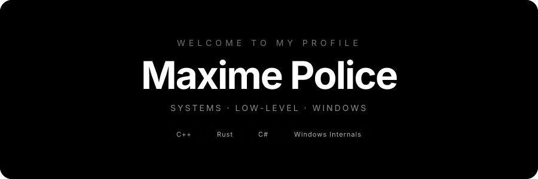
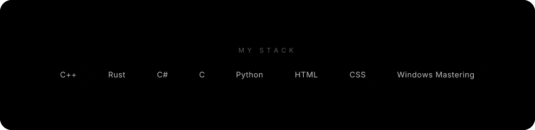

## 📊 GitHub Stats

  

  

  

## 📬 Get In Touch

  <b>Telegram</b> · <code>@NagiOnTop</code> &nbsp;·&nbsp; <b>Discord</b> · <code>maximepolice</code>

  Crafted with <a href="https://github.com/collectioneur/readme-aura">readme-aura</a> · React/JSX → SVG

